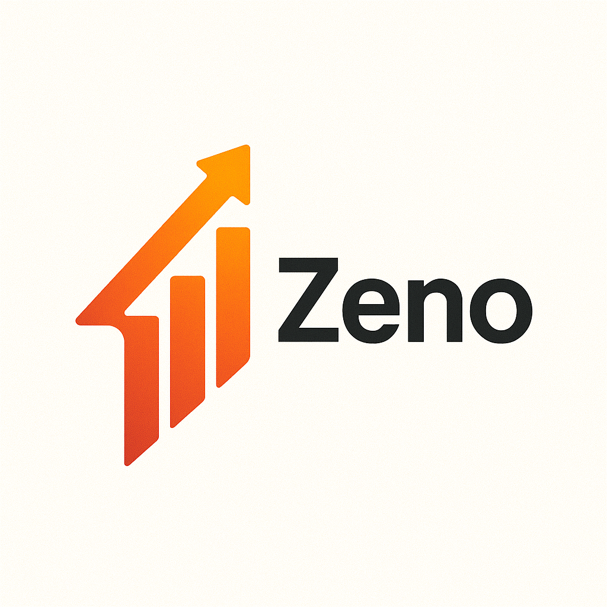

<p align="center">
  
</p>

# Zeno

**Zeno** is a Go-based AWS Cost & Usage Report (CUR) ingestion and analytics engine, optimized for Prometheus metrics and Grafana visualization. It provides a programmable, extensible foundation for cost monitoring, attribution, and forecasting.

---

## 🔍 Key Challenges

1. **High-Volume, High-Detail Data**: AWS CUR exports produce millions of records daily, requiring efficient ingestion, transformation, and storage.
2. **Granular Attribution**: Teams need to slice costs by service, account, region, tags, and custom dimensions.
3. **Metric Export**: Integrating billing data into existing observability stacks (e.g., Prometheus/Grafana) demands a compatible exporter.
4. **Predictive Insights**: Forecasting cost trends is critical for budgeting and anomaly detection.

---

## 🛠 Technical Overview

* **Config-Driven**: Centralized YAML configuration supports AWS credentials (static, profile, IAM role) and CUR parameters (S3 bucket, prefix, schedule, format).
* **Pluggable AWS Auth**: Sequential fallback between static creds, shared profiles, and STS-based role assumption.
* **CUR Fetcher**: Lists, downloads, and decompresses CUR files from S3, with CSV and Parquet support.
* **Storage Abstraction**: Ingested data can be persisted into DuckDB (or any database adapter) via an internal store package.
* **Prometheus Exporter**: Exposes cost metrics (`zeno_daily_cost{service,account,region}`) on `/metrics` for seamless scraping.
* **Test Coverage**: Comprehensive unit tests for configuration, AWS auth flows, and CUR fetch logic.
* **CI/CD**: GitHub Actions pipeline handling linting (`go fmt`, `go vet`, `golangci-lint`), secret scanning, auto-generated Go docs, and build artifacts.

---

## 📂 Repository Structure

```
├── cmd/zeno         # CLI / HTTP server entrypoint
├── internal
│   ├── config       # YAML schema, loader, validation, tests
│   ├── aws
│   │   ├── auth      # AWS session builder, STS role, tests
│   │   └── cur       # CUR S3 client, downloader, tests
│   ├── ingest       # Ingestion pipeline: S3 → DuckDB
│   └── store        # DuckDB migrations, upserts, queries
├── assets           # Logo and diagrams
├── docker           # Dockerfile and build context
├── Makefile         # Lint, test, build, container targets
└── .github/workflows/ci.yml  # CI/CD pipeline
```

---

## ⚡️ Quick Start

1. **Configure** your `config.yaml` (see `config/test_data` for examples).
2. **Build** the binary:  `make build`
3. **Run** the server:  `./bin/zeno --config config.yaml`
4. **Scrape** metrics: visit `http://localhost:8080/metrics` in Prometheus.

---

## 🚀 Roadmap

* **Forecast Engine**: Time-series models for spend prediction.
* **Grafana Plugin**: Custom datasource for ad-hoc queries.
* **Tag-Aware Ingestion**: Automated cost allocation based on resource tags.
* **High-Availability**: Kubernetes operator and Helm charts.

---

## 📜 License

Apache License 2.0 © 2025 Zeno Authors
